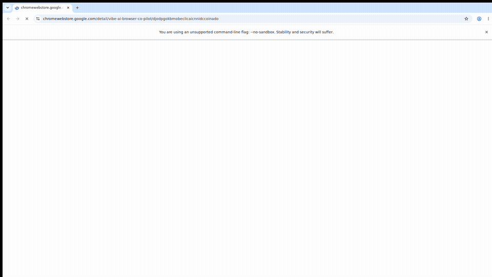
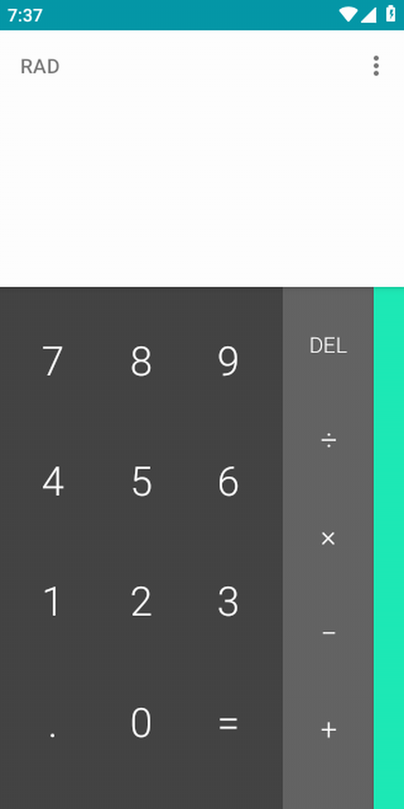
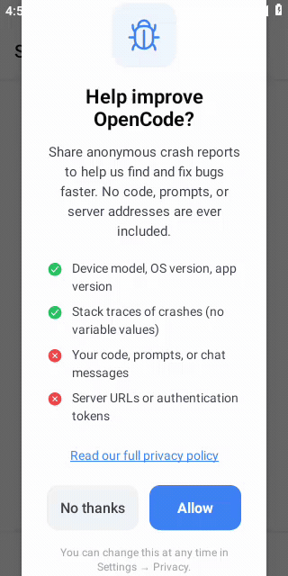
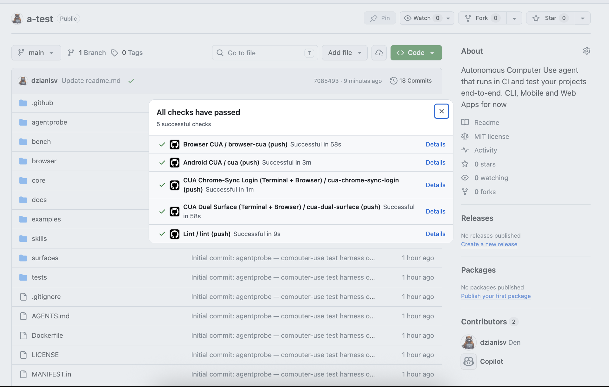

# a-test
> create by [Agent Labs](https://agentlabs.cc) w/ ❤️ to AI agents

[](https://youtu.be/qFeNZg59QJ0)

**Stop pet-sitting your AI coding agent.**

AI coding agents write code fast, but a green CI run doesn't prove the app actually works — someone still has to babysit the PR and click through it by hand. a-test turns your product's user journeys — the ones already scoped in a PRD — into computer-use test cases committed as YAML, then executes them in CI to drive the real app: clicking, typing, waiting, and verifying what's actually on screen.

That's what gates bad AI-written PRs before they reach production. Every run leaves behind screenshots, a video, and a GIF, plus an independent vision-model verdict — not brittle selectors or a "looks good to me" review.

**From PRD to CI gate:**
1. Write user journeys in a PRD
2. Commit them as YAML test cases
3. CI drives the real app — click, type, wait, verify
4. Get screenshots, video, and a GIF, plus a vision verdict, before merge

Models:
- OpenAI models on Azure and api.openai.com
- [H-Company](https://hub.hcompany.ai) Holo models `holo3-1-35b-a3b`, `holo3-122b-a10b`
Test Android apps and browser extensions with a computer-use agent.

Apps:
- Mobile: in Android emulator, iOS emulator 9comming soon...)
- WebApps: in Google Chrome
- Chrome Extensions: in Google Chrome
- Terminal/CLI apps: spawns linux terminal

***

An agent looks at screenshots, decides what to tap or type, and runs until the goal is met or the step budget is exhausted. When the run ends, a second vision call judges the final screenshot against the case's success criteria — so a `pass` means the result was actually confirmed on screen, not just claimed by the agent. The run produces a GIF you can inspect to see exactly where it succeeded or got confused.

## Why this exists

I've been building computer-use (CUA) end-to-end tests across my projects at
[agentlabs.cc](https://agentlabs.cc) for a while — each one needing a different flavor of E2E
coverage:

- **[agentpod.agentlabs.cc](https://agentpod.agentlabs.cc)** — agent-pod flows
- **[vibebrowser.app](https://vibebrowser.app)** — a Chrome extension / AI browser co-pilot
- **[opencode.agentlabs.cc](https://opencode.agentlabs.cc)** — coding-agent workflows

Every project ended up with its own hand-rolled CUA tests: different surfaces, different pass
conditions, all requiring real end-to-end testing rather than mocks. For this hackathon I decided to
**consolidate that knowledge, codebase, and expertise into one open-source CUA framework** — a single
computer-use agent packaged as an easy-to-install, reusable **GitHub Action** so any codebase can be
covered with real end-to-end tests. *(Reusable-action coverage across all three projects is still in
progress.)*


## QA

**What is it?** A harness that lets vision models test real Android apps and Chrome: screenshot → decide action → tap/type/scroll → verify result.

**Why not Playwright/Appium?** Those depend on selectors; ours can operate from what a user actually sees.

**How do you prevent false passes?** A separate vision judge checks the final screenshot; agent self-reported “done” is not enough.

**What’s the demo?** Agent solves a calculator problem, checks live weather content, or verifies a Chrome extension install flow.

Limitations? Android and browser only today; no iOS, device farm, or dashboard yet.

## Demo: Agents in Action

**Android**: Agent solves arithmetic (computes 27 + 18 = 45)


**Browser**: Agent navigates Chrome Web Store, verifies Vibe extension is published


## Showcase

### Android Calculator

A real computer-use agent completes 27 + 18 = 45 in the Android Calculator app — a genuine CUA demo, not a static screenshot check.



### Vibe AI Browser Co-Pilot

**Vibe AI Browser Co-Pilot, end to end with CUA (10x speed)**: the agent installs the extension from the real Chrome Web Store on CI (Xvfb + xdotool real clicks + vision-based click targeting), opens the side panel, signs in to Vibe Portal with real keystrokes, then executes an agentic task — "go to duckduckgo and ask when a first gpt model were released" — navigating the browser to duckduckgo.com and answering GPT-1, June 2018, with the reply visible in the side panel. Every step is asserted (CDP page targets, `chrome.storage`, DOM transcript) and screen-recorded.


Reference implementation: `tests/cua/cws-visual-install.ts` in [VibeTechnologies/VibeWebAgent PR #1504](https://github.com/VibeTechnologies/VibeWebAgent/pull/1504); extraction of these primitives into a-test core is tracked in [issue #1](https://github.com/dzianisv/a-test/issues/1).

### OpenCode Mobile: Android onboarding + real coding task

**[OpenCode Mobile](https://github.com/dzianisv/opencode-mobile)**, an open-source Android client for the opencode AI coding agent, is CUA-tested end to end on a real Android emulator: the agent adds a server connection, connects and confirms the session list loads a pre-existing session from the live opencode server (proving real data, not an empty screen), opens a new AI coding session, and submits a real Python task — `helloworld.py` plus a `helloworld_test.py` pytest suite — then waits for the agent to finish writing files and verifies the output before checking the Settings/model screen. Verification is layered: a session pre-created via opencode's own HTTP API must be visible in-app (deterministic, server-side truth) alongside on-screen text/state assertions at each phase, with every step screen-recorded.



**▶ Watch the full recording: [mp4](https://raw.githubusercontent.com/dzianisv/opencode-mobile/main/docs-site/demo.mp4)**

Provenance: [`CUA Smoke Test` run #28041009456](https://github.com/dzianisv/opencode-mobile/actions/runs/28041009456) (green on `main`), workflow [`cua-smoke.yml`](https://github.com/dzianisv/opencode-mobile/blob/main/.github/workflows/cua-smoke.yml), script [`scripts/android-cua-smoke.py`](https://github.com/dzianisv/opencode-mobile/blob/main/scripts/android-cua-smoke.py).

## Terminal + Browser dual-surface testing

Some flows span two surfaces at once — a CLI in a terminal driving a browser-based auth step, for
example. `examples/dual-surface/chrome-sync-login.ts` is the reference case: a real `xterm` runs the
PUBLISHED `chrome-sync login` CLI on the left, a real Chrome window completes the resulting `/auth/cli`
email/password form on the right, and both are screen-recorded together into one video.

The pass/fail verdict is layered, not vibes-based:
- a **deterministic oracle** — the CLI's own local callback server prints `✓ Authenticated as <name>` to
  its stdout the moment the login round-trip actually completes, and the same string is rendered
  server-side in the browser tab, so the test polls plain text output rather than guessing at DOM state;
- an **independent vision judge** on the final screenshot, asking a strict YES/NO with a quoted evidence
  string (default NO) — catches the case where the deterministic signal is present but the screen itself
  looks wrong.


*Left: a real `xterm` running the published `chrome-sync login` CLI. Right: a real Chrome completing the `/auth/cli` form. Both recorded together in CI.* **▶ Watch the full video: [webm](https://github.com/dzianisv/a-test/releases/download/chrome-sync-login-demo/chrome-sync-login-dual-surface.webm) · [mp4](https://github.com/dzianisv/a-test/releases/download/chrome-sync-login-demo/chrome-sync-login-dual-surface.mp4)** — both validated by `core/validate-video.ts` (22.3s, decodes clean, non-blank). WebM is a streaming container natively, so it sidesteps the mp4 `moov`/`+faststart` "shows 0:00" pitfall entirely; the validator applies the faststart check only to mp4/mov.

This runs on every push via the `cua-chrome-sync-login.yml` GitHub Actions workflow (green on `main`).
A sibling workflow, [`cua-chrome-sync-login-hcompany.yml`](.github/workflows/cua-chrome-sync-login-hcompany.yml), runs the same case backed by H Company's Holo Models API (model `holo3-1-35b-a3b`) via the `HAI_API_KEY` repo secret, on `workflow_dispatch` plus a daily schedule rather than every push — see [docs/ci.md](docs/ci.md) for setup.
Two supporting pieces make the recording trustworthy rather than just present:
- **`core/validate-video.ts`** — proves the recording actually plays (duration, `+faststart`, clean
  decode, non-blank sampled frames) before anyone calls the video "done". See below.
- **[`skills/a-test-video-github-upload/SKILL.md`](skills/a-test-video-github-upload/SKILL.md)** —
  how to get that recording onto a GitHub PR/issue/Release and validate the *served* bytes, not just the
  local file.

## Computer-use models: H Company Holo

a-test is model-agnostic (any OpenAI-compatible vision endpoint works), but it is built and
verified to run on **[H Company](https://hub.hcompany.ai)'s computer-use models**. H Company
offers a free, rate-limited tier to get started — no upfront cost, no trial period, just a
[key from the portal](https://portal.hcompany.ai) and you're running (see rate limits below).

H Company's **Holo** models are *grounding/localization* specialists: given a screenshot and a
short description of a UI element ("the Settings icon"), Holo returns exactly where to click.
a-test pairs Holo with a lightweight planner in a **two-tier loop** — the planner decides
*what* to do next, Holo resolves *where* on screen it is — so every tap lands on a real,
model-chosen pixel rather than a guessed coordinate.

| Piece | Role | Default |
| --- | --- | --- |
| **Grounder** | screenshot + element description → click coords | `holo3-1-35b-a3b` (free tier, 5 req/min) |
| **Planner** | decides the next action from the goal + screen | any OpenAI-compatible vision chat model |

Holo returns coordinates normalized to `[0, 1000]`; a-test scales them to real pixels
(`a_test/grounding.py:scale_holo_coords`) and throttles calls to respect the free-tier rate
limit (`HoloRateLimiter`).

```bash
# 1. Get a key at https://portal.hcompany.ai and export it
export HAI_API_KEY=...

# 2. Run any case against the Holo backend (grounder=Holo, planner from bench/backends.yaml)
python -m bench.run --backends holo --cases examples/android/calculator_math.py
```

The Holo backend is registered in [`bench/backends.yaml`](bench/backends.yaml) — no code changes
needed to point at `holo3-122b-a10b` (paid) or a self-hosted open-weight Holo checkpoint from
[Hugging Face](https://huggingface.co/Hcompany).

For CI wiring (GitHub Actions), see the ["Desktop (Terminal + Browser)"](docs/ci.md#desktop-terminal--browser)
reusable action in [docs/ci.md](docs/ci.md), which auto-detects `HAI_API_KEY` alongside
`AZURE_CUA_API_KEY`/`OPENAI_API_KEY`.

## What it is / what it isn't

- **Is**: a test harness that drives a real Android device (via adb) or real Chrome (via CDP) using an LLM agent
- **Is**: verified against H Company's Holo computer-use grounding models (`api.hcompany.ai`)
- **Is not**: a record-and-replay tool, a UI automator, or a headless browser test runner

## Install

**Not yet published to PyPI.** The `a-test` distribution name is reserved (verified
free) and `.github/workflows/publish-pypi.yml` will publish it automatically the
first time a `vX.Y.Z` tag is pushed — but no tag has been cut yet, so
`pip install a-test` does not resolve to anything today. Until the first release,
install directly from source, pinned to a commit SHA (never a branch name — see
[docs/VERSIONING.md](docs/VERSIONING.md)):

```bash
pip install "git+https://github.com/dzianisv/a-test.git@<commit-sha>"
```

Find `<commit-sha>`: `git ls-remote https://github.com/dzianisv/a-test.git main`, or
copy a commit SHA from the GitHub UI. Once a release ships, this section will change
to the real `pip install a-test`.

The browser backend is a Bun/TypeScript runner that lives in `browser/` and runs from
a repo checkout — it is not shipped inside the pip package. For `--target browser`,
clone the repo and install [bun](https://bun.sh):

```bash
git clone https://github.com/dzianisv/a-test
cd a-test
pip install -e .
cd browser && bun install
```

**Using the browser runner as a dependency (not a full clone):** the npm name
`a-test-cua` (see `package.json`) is reserved but not yet published either. Until
it is, add it as a pinned git dependency:

```bash
bun add github:dzianisv/a-test#<commit-sha>
# or: npm install github:dzianisv/a-test#<commit-sha>
```

## Quickstart: Android

Requires: `adb` in PATH, a connected device or emulator, an Azure OpenAI key.

```bash
export AZURE_CUA_API_KEY=...
export AZURE_CUA_BASE_URL=https://<your-resource>.openai.azure.com/
export AZURE_CUA_MODEL=gpt-5.4

a-test run \
  --target android \
  --case examples/android/calculator_math.py \
  --output-dir /tmp/a-test-output

open /tmp/a-test-output/demo.gif
```

## Quickstart: Browser

Requires: `bun` in PATH, `xdotool`, `scrot`, `ffmpeg`, and an Azure OpenAI key.

```bash
export AZURE_CUA_API_KEY=...
export AZURE_CUA_BASE_URL=https://<your-resource>.openai.azure.com/
export AZURE_CUA_MODEL=gpt-5.4

a-test run \
  --target browser \
  --case examples/open-weather.yaml \
  --output-dir /tmp/a-test-output

open /tmp/a-test-output/demo.gif
```

To test a Chrome extension: write a YAML case whose goal navigates Chrome to the
Chrome Web Store and installs the extension. There is no `--extension` flag — the
agent installs it through the browser UI, just like a user would.

## Example test case

```python
from a_test import TestCase, run_case

case = TestCase(
    name="calculator_math",
    package="com.android.calculator2",   # launches the app before CUA runs
    instruction="Compute 27 + 18 using the keypad, then verify the result 45 is displayed.",
    successCriteria=["Calculator is open with a numeric keypad", "Result 45 is displayed"],
    failureCriteria=["App crashes or shows error dialog"],
    maxSteps=25,
)

result = run_case(case, output_dir="/tmp/a-test-output")
print(result["verdict"], "--", result["reason"])
# pass -- YES. The calculator shows 45 after computing 27 + 18.
```

`run_case` brings the app to foreground, drives the device via the CUA loop, judges
the final screenshot, assembles `demo.gif`, and writes `result.json`.

**Optional: Reasoning captions in GIFs**

Install Pillow to add text overlays showing the agent's reasoning at each step:

```bash
pip install "git+https://github.com/dzianisv/a-test.git@<commit-sha>#egg=a-test[gif-captions]"
```

With Pillow installed, `demo.gif` will include text annotations:
- Frame 1: "TAP: Entering digit 2"
- Frame 2: "TAP: Entering digit 7"
- Frame 3: "TAP: Clicking plus operator"
- ...
- Final: "VERIFY: Checking if result 45 is visible"

This makes demos much more educational — viewers see the agent's reasoning in action, not just screenshots.

## Output shape

```
/tmp/a-test-output/
  calculator_math_01.png     # one screenshot per CUA step
  calculator_math_02.png
  ...
  calculator_math.mp4        # screen recording (Android)
  demo.gif                  # assembled from all step screenshots
  result.json               # {"verdict": "pass", "reason": "...", "steps": 7}
```

## CI Integration (GitHub Actions)


*Screenshot: a successful GitHub Actions CI run with all checks passing.*

### Recommended: unified action (auto-detects environment)

This is the recommended way to use a-test in CI — it auto-detects android/browser/desktop from the script path (`.ts` → desktop, path/filename containing `android` → android, otherwise → browser), so you don't need to pick a per-surface action yourself:

```yaml
jobs:
  cua:
    runs-on: ubuntu-latest
    timeout-minutes: 30
    steps:
      - uses: actions/checkout@v4
      - uses: dzianisv/a-test/.github/actions/a-test@main
        with:
          script: examples/open-weather.yaml
        env:
          AZURE_CUA_API_KEY: ${{ secrets.AZURE_CUA_API_KEY }}
          AZURE_CUA_BASE_URL: ${{ secrets.AZURE_CUA_BASE_URL }}
      - uses: actions/upload-artifact@v4
        if: always()
        with:
          name: cua-output
          path: /tmp/a-test-output/
```

Set the `environment` input to `android`, `browser`, or `desktop` to bypass auto-detection when it doesn't infer what you want. As with the per-surface actions below, secrets always go in the calling job's `env:` block — this action has no input for any API key. See [docs/ci.md](docs/ci.md#unified-action-recommended) for the full input reference.

The per-surface actions below (`a-test-android`, `a-test-browser`, `a-test-desktop`) remain fully supported — use them directly when you want to pin a workflow to a single surface explicitly. The unified action also accepts their surface-specific inputs (such as `api-level`, `apk-path`, and `hai-base-url`).

### Android — one-liner via reusable action

```yaml
jobs:
  cua-android:
    runs-on: ubuntu-latest
    timeout-minutes: 45
    steps:
      - uses: actions/checkout@v4
      - uses: dzianisv/a-test/.github/actions/a-test-android@<pinned-commit-sha>  # pin to a commit SHA, not a branch — see docs/VERSIONING.md
        with:
          case: examples/android/calculator_math.py
          api-level: '33'
          apk-path: path/to/app.apk   # optional: install APK before test
          output-dir: /tmp/cua-output
        env:
          AZURE_CUA_API_KEY: ${{ secrets.AZURE_CUA_API_KEY }}
          AZURE_CUA_BASE_URL: ${{ secrets.AZURE_CUA_BASE_URL }}
      - uses: actions/upload-artifact@v4
        if: always()
        with:
          name: cua-output
          path: /tmp/cua-output/
```

### Browser — one-liner via reusable action

```yaml
jobs:
  cua-browser:
    runs-on: ubuntu-latest
    timeout-minutes: 30
    steps:
      - uses: actions/checkout@v4
      - uses: dzianisv/a-test/.github/actions/a-test-browser@<pinned-commit-sha>  # pin to a commit SHA, not a branch — see docs/VERSIONING.md
        with:
          case: examples/open-weather.yaml
          output-dir: /tmp/cua-output
        env:
          AZURE_CUA_API_KEY: ${{ secrets.AZURE_CUA_API_KEY }}
          AZURE_CUA_BASE_URL: ${{ secrets.AZURE_CUA_BASE_URL }}
      - uses: actions/upload-artifact@v4
        if: always()
        with:
          name: cua-output
          path: /tmp/cua-output/
```

### Desktop (Terminal + Browser) — one-liner via reusable action

```yaml
jobs:
  cua-desktop:
    runs-on: ubuntu-latest
    timeout-minutes: 30
    steps:
      - uses: actions/checkout@v4
      - uses: ./.github/actions/a-test-desktop
        with:
          case: examples/dual-surface/chrome-sync-login.ts
          output-dir: /tmp/cua-output
          model: holo3-1-35b-a3b
        env:
          # Backend auto-detected in priority order: AZURE_CUA_API_KEY ->
          # OPENAI_API_KEY -> HAI_API_KEY. HAI_BASE_URL is optional (defaults
          # to https://api.hcompany.ai/v1/).
          HAI_API_KEY: ${{ secrets.HAI_API_KEY }}
      - uses: actions/upload-artifact@v4
        if: always()
        with:
          name: cua-output
          path: /tmp/cua-output/
```

See [`.github/workflows/cua-chrome-sync-login-hcompany.yml`](.github/workflows/cua-chrome-sync-login-hcompany.yml) for a real example of this action running against H Company's free tier on a daily schedule, and [docs/ci.md](docs/ci.md#desktop-terminal--browser) for the complete reference (all three backend variants, required-secrets table).

### Manual setup (without the reusable action)

<details>
<summary>Android full workflow</summary>

```yaml
jobs:
  cua-android:
    runs-on: ubuntu-latest
    timeout-minutes: 45
    steps:
      - uses: actions/checkout@v4
      - uses: actions/setup-python@v5
        with:
          python-version: "3.11"
      - run: pip install -e .
      - run: sudo apt-get install -y ffmpeg
      - name: Enable KVM
        run: |
          echo 'KERNEL=="kvm", GROUP="kvm", MODE="0666", OPTIONS+="static_node=kvm"' | sudo tee /etc/udev/rules.d/99-kvm4all.rules
          sudo udevadm control --reload-rules
          sudo udevadm trigger --name-match=kvm
      - uses: reactivecircus/android-emulator-runner@v2
        with:
          api-level: 33
          arch: x86_64
          emulator-options: -no-window -gpu swiftshader_indirect -noaudio -no-boot-anim -no-snapshot
          disable-animations: true
          script: a-test run --target android --case examples/android/calculator_math.py --output-dir /tmp/cua-output
        env:
          AZURE_CUA_API_KEY: ${{ secrets.AZURE_CUA_API_KEY }}
          AZURE_CUA_BASE_URL: ${{ secrets.AZURE_CUA_BASE_URL }}
          AZURE_CUA_MODEL: gpt-5.4
      - uses: actions/upload-artifact@v4
        if: always()
        with:
          name: cua-output
          path: /tmp/cua-output/
```

</details>

<details>
<summary>Browser full workflow</summary>

```yaml
jobs:
  cua-browser:
    runs-on: ubuntu-latest
    timeout-minutes: 30
    steps:
      - uses: actions/checkout@v4
      - uses: actions/setup-python@v5
        with:
          python-version: "3.11"
      - run: pip install -e .
      - uses: oven-sh/setup-bun@v2
      - run: cd browser && bun install
      - name: Install system deps
        run: sudo apt-get update && sudo apt-get install -y xvfb xdotool scrot ffmpeg
      - name: Start Xvfb
        run: |
          Xvfb :99 -screen 0 1920x1080x24 &
          echo "DISPLAY=:99" >> $GITHUB_ENV
      - name: Run CUA test
        env:
          AZURE_CUA_API_KEY: ${{ secrets.AZURE_CUA_API_KEY }}
          AZURE_CUA_BASE_URL: ${{ secrets.AZURE_CUA_BASE_URL }}
          CUA_MODEL: gpt-5.4
          DISPLAY: ':99'
        run: a-test run --target browser --case examples/open-weather.yaml --output-dir /tmp/cua-output
      - uses: actions/upload-artifact@v4
        if: always()
        with:
          name: cua-output
          path: /tmp/cua-output/
```

</details>

## Architecture

- **Android**: Python → adb → screenshot → LLM → action → repeat
- **Browser**: TypeScript/Bun → CDP + xdotool → screenshot → LLM → action → repeat
- Shared test-case schema (`TestCase`) works for both targets
- See [docs/architecture.md](docs/architecture.md)

## Writing test cases

See [docs/writing-cases.md](docs/writing-cases.md) and [skills/write-cua-test/SKILL.md](skills/write-cua-test/SKILL.md).

## CI integration docs

See [docs/ci.md](docs/ci.md) and [skills/a-test-ci/SKILL.md](skills/a-test-ci/SKILL.md).


# Models
## H-Company Holo

> Point it at `https://api.hcompany.ai/v1/` with your `HAI_API_KEY` and it just works. See
> [Computer-use models](#computer-use-models-h-company-holo).
